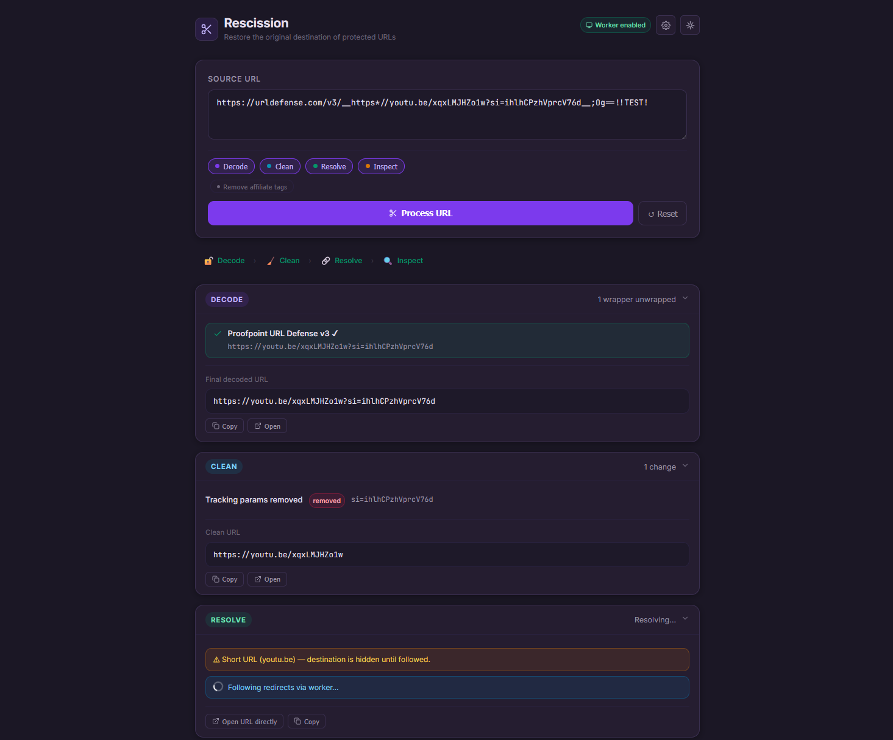

# Rescission

Clean, unwrap, and inspect any URL.

A browser-based pipeline tool for making sense of URLs. Strip tracking and affiliate parameters off a share link, expand a shortened URL, unwrap a security-rewritten link from Proofpoint or Safe Links, follow a redirect chain to its destination, or break a URL down into its component parts — one paste, and nothing ever leaves your browser.

Useful for anyone who wants a cleaner link before sharing it, wants to know where a shortened or wrapped URL actually goes before clicking, or just wants to see what all those `?utm_...` parameters really are. Equally at home stripping the tracking junk off a YouTube link as it is decoding an email security gateway's rewritten URL.

#### Screenshot


#### Live Demo
[https://badbox29.github.io/rescission/](https://badbox29.github.io/rescission/)

---

## Features

### Processing Pipeline

Rescission processes URLs through up to four sequential stages. Each stage can be individually enabled or disabled via pill toggles directly under the input field. Stages run in order and pass their output to the next — so a decoded URL gets cleaned, the clean URL gets resolved, and the final URL gets inspected.

#### Stage 1 — Decode
Unwraps security-rewritten URLs from known email security services, recovering the original destination embedded in the link. Handles nested wrappers (e.g. a Safe Links URL wrapping a Proofpoint URL) by iterating until no further decoding is possible, up to 10 layers deep.

Each decode attempt is reported as a step with one of three outcomes:
- **Decoded** — the original URL was successfully recovered
- **Opaque token** — the service was detected but the URL is a server-side-only redirect that cannot be recovered locally
- **No wrappers detected** — the URL does not match any known service

**Supported services:**

| Service | Decode type | Verified |
|---|---|---|
| Proofpoint URL Defense v3 | Full decode | ✓ |
| Proofpoint URL Defense v2 | Full decode | ✓ |
| Microsoft Safe Links | Full decode | ✓ |
| Barracuda Email Security | Full decode | ✓ |
| Mimecast URL Protect | Full decode (modern format) / opaque (legacy) | ✓ |
| Cisco Umbrella | Detect only (opaque token) | ✓ |
| Google Redirect | Full decode | ✓ |
| Symantec / Broadcom Email Security | Full decode | — |
| Trend Micro IMSVA | Full decode | — |
| Check Point Email Security | Detect only | — |
| Generic redirect params | Full decode (`url=`, `target=`, `dest=`, `redirect=`, and others) | — |

Verified services have been tested against real-world links and confirmed to produce correct output. Unverified services are implemented based on documented formats but have not been validated against live samples.

The Proofpoint v3 decoder correctly handles the run-length `**X` token format and applies the full replacement character map in the correct forward order. The v2 decoder uses scoped hex replacement (`-XX` → `%XX`) with a fail-closed validator to avoid emitting corrupted output on partial matches.

#### Stage 2 — Clean
Removes noise from the URL that serves tracking or monetization purposes rather than identifying the actual content. Reports each action taken with a `removed`, `changed`, `kept`, or `none` badge.

**Tracking parameter removal** — strips ~50 known tracking query parameters including:
- UTM family (`utm_source`, `utm_medium`, `utm_campaign`, `utm_term`, `utm_content`, and extended variants)
- Google Ads / Analytics (`gclid`, `gbraid`, `wbraid`, `dclid`, `gad_source`, `_ga`, `_gl`)
- Meta / Facebook (`fbclid`, `fb_action_ids`, `fb_source`)
- Microsoft / Bing (`msclkid`)
- LinkedIn (`li_fat_id`)
- Twitter / X (`twclid`)
- TikTok (`ttclid`)
- YouTube (`si` share-tracking token)
- HubSpot (`_hsmi`, `_hsenc`, `hsCtaTracking`)
- Marketo (`mkt_tok`)
- Mailchimp (`mc_cid`, `mc_eid`)
- Sailthru, Adobe, and others

This is the everyday workhorse of the tool: paste a `youtu.be/...?si=...` share link or a newsletter link buried in `utm_` parameters, and get back the clean, shareable URL.

**Affiliate tag removal** *(optional sub-toggle)* — removes monetization and referral parameters such as `tag`, `aff`, `affiliate`, `aff_id`, Amazon associate tags, and similar partner tracking values.

**Normalization:**
- Removes default ports (`:80` for HTTP, `:443` for HTTPS, `:21` for FTP)
- Collapses duplicate slashes in the URL path
- Lowercases the hostname

#### Stage 3 — Resolve
Follows redirects to find the final destination, with honest reporting about what can and cannot be determined locally.

- **Short URL detection** — identifies links from known URL shorteners (bit.ly, t.co, tinyurl.com, youtu.be, amzn.to, and ~30 others) and flags them for expansion
- **Local analysis** — runs with no network access at all, flagging short URLs and suspicious redirect-style subdomains. This is the default when no worker is configured.
- **Full redirect chain** *(optional, requires a worker)* — when you've configured your own Cloudflare Worker (see below), this stage follows the complete redirect chain server-side and displays each hop with its status code, server header, and redirect target, plus the final destination and total resolution time
- The card renders immediately with local analysis and updates in place when the worker result returns; errors (timeout, worker unreachable) are reported clearly rather than left hanging

#### Stage 4 — Inspect
Breaks the URL down into its structural components and evaluates it for security signals.

**URL breakdown:**
- Scheme, host, subdomain, TLD / registrable domain
- Port (with default vs. explicit distinction)
- Path, query string, fragment

**Query parameters table** — lists every parameter and its decoded value.

**Security indicators** — flags conditions worth noting:
- HTTPS vs. plain HTTP
- IDN / Punycode hostname (potential homograph attack)
- IP address used as hostname
- Excessive subdomain depth
- Suspicious TLD (`.tk`, `.ml`, `.xyz`, `.click`, and others commonly associated with phishing)
- Credentials embedded in the URL (`user:pass@host`)
- Non-standard port
- Unusually long URL (>400 characters, common in obfuscated links)
- High query parameter count (>8)

Each indicator is color-coded: green (safe), amber (worth noting), red (potential issue), blue (informational).

---

### Input & Controls

- **Source URL field** — paste any URL; multi-line for long wrapped links
- **Stage toggles** — pill buttons under the input field enable/disable individual pipeline stages
- **Affiliate sub-toggle** — appears under the Clean toggle when Clean is active; off by default
- **Process URL button** — runs the pipeline (also triggered by Ctrl/Cmd + Enter)
- **Reset button** — clears input and results

---

### Results Display

- Each stage produces a collapsible result card with a summary visible in the header — no need to expand to see the key finding
- Cards expand/collapse by clicking the header
- Every URL output in the results has **Copy** and **Open** actions
- A **pipeline status bar** updates live as stages complete, showing running / done / error / skipped state per stage
- The Resolve card updates in place when the async network result arrives, without re-rendering other cards

---

### Theme

- Dark mode by default; full light mode available via the toggle in the header
- Theme preference persisted to `localStorage`

---

### Privacy

All processing — decoding, cleaning, URL parsing, and structural inspection — happens entirely in your browser. Nothing is transmitted anywhere by default. The only stage that makes an outbound request is Resolve (redirect following), and only when you've configured your own Cloudflare Worker for it. With no worker configured, Resolve falls back to local-only analysis and the tool is fully self-contained. Even with a worker, only the URL being resolved is sent — to infrastructure you control.

---

## Usage

This is a three-file static tool — no build tools, no dependencies, no server required.

1. Open `index.html` in any modern browser (or serve from any static host)
2. Paste a URL into the **Source URL** field
3. Enable or disable stages as needed using the toggles
4. Click **Process URL**

Results appear below the input, one card per stage, in processing order.

---

## File Structure

```
rescission/
  index.html        ← markup shell; no inline scripts or styles
  css/
    styles.css      ← full theme system and all component styles
  js/
    app.js          ← decode, clean, resolve, and inspect engines + UI controller
  worker.js         ← optional Cloudflare Worker for the Resolve stage (deploy separately)
```

The JavaScript has no external dependencies and does not use any framework. It runs in any modern browser without a build step. `worker.js` is optional and only needed if you want the Resolve stage to follow full redirect chains — see below.

---

## Optional: Redirect-Following Worker

The Resolve stage can follow full redirect chains, but redirect following requires a server-side request (browsers block cross-origin fetches). Rather than route your links through a shared public proxy, Rescission uses a Cloudflare Worker you deploy yourself. It's optional — without it, Resolve still runs local-only analysis.

**Deploy the worker:**
1. Copy `worker.js` from this repo
2. In the Cloudflare dashboard, go to **Workers & Pages → Create → Create Worker**
3. Paste `worker.js` and click **Deploy**
4. Go to the worker's **Settings → Variables** and add an environment variable named `ALLOWED_ORIGINS`, set to the origin(s) you'll use the tool from — comma-separated for more than one, e.g. `https://yourusername.github.io,http://localhost:5500`
5. Copy your worker's URL (e.g. `https://rescission.yoursubdomain.workers.dev`)

**Connect it in the app:**
1. Open Rescission and click the gear icon (top right)
2. Paste your worker URL and click **Test** to verify the connection
3. Click **Save**

The header chip changes from **🔒 Local only** to **Worker enabled** once a worker is saved and its connection test passes. The worker URL is stored in your browser's `localStorage` (key `resc-settings`) and never sent anywhere except to the worker itself.

**Worker environment variables:**
- `ALLOWED_ORIGINS` *(required)* — comma-separated list of origins allowed to call the worker. The worker checks each request's `Origin` header against this list and rejects mismatches with a 403.
- `MAX_HOPS` *(optional)* — maximum redirects to follow (default 10)
- `TIMEOUT_MS` *(optional)* — per-hop fetch timeout in milliseconds (default 5000)

---

## Hosting

Serve the three front-end files from any static host maintaining the directory structure. GitHub Pages, Cloudflare Pages, Netlify, or a local web server all work. (`worker.js` is deployed separately to Cloudflare Workers, not served as a static file.)

**GitHub Pages example:**
1. Push the `rescission/` directory to a repository
2. Go to Settings → Pages → Source → select branch
3. Access at `https://yourusername.github.io/yourrepo/`

---

## Decoder Implementation Notes

### Proofpoint v2
Encoding scheme: a bare underscore (`_`) represents a forward slash; a hyphen followed by two hex digits (`-XX`) is a percent-encoded byte (including a literal hyphen encoded as `-2D`). The replacement is scoped to the `-XX` pattern to avoid corrupting legitimate hyphens in domain names and paths. The decoded result is validated before being returned; if it does not parse as a plausible URL, the decoder reports failure rather than emitting garbled output.

### Proofpoint v3
The encoded URL is base64url-encoded with special characters replaced by `*` markers (single replacement) or `**X` run-length tokens (where `X` maps to a repeat count via a defined character map: A=2…Z=27, a=28…z=53, 0=54…9=63, `-`=64, `_`=65). Replacements are applied in forward order against the sequence of special characters (`!*'();:@&=+$,/?#[]%`). The decoder implements the full run-length logic; an earlier implementation that omitted `**X` handling would produce corrupted output on any URL with consecutive special characters in the query string.

### Mimecast
Modern Mimecast links embed the destination URL in a `u=` query parameter (URL-encoded). Older links use an opaque path-based token that is a server-side-only redirect — the original URL is not present in the link and cannot be recovered locally. When an opaque token is detected, the tool reports this honestly rather than returning a wrong result.

### Nested wrappers
The decode stage iterates up to 10 times, passing each successfully decoded URL back through the full service registry. This handles real-world cases like a Safe Links link wrapping a Proofpoint link, which in turn wraps the actual destination.

---

## Security Indicator Reference

| Indicator | Severity | Meaning |
|---|---|---|
| HTTPS | ✓ Safe | Connection is encrypted in transit |
| Not HTTPS | ✗ Bad | Plain HTTP — contents and destination unencrypted |
| IDN / Punycode domain | ⚠ Warn | Domain uses internationalized characters; possible homograph phishing attack |
| IP address host | ⚠ Warn | Hostname is a raw IP address rather than a domain name |
| Subdomain depth > 4 | ⚠ Warn | Unusual number of subdomain levels; sometimes used to make fake domains look legitimate |
| Suspicious TLD | ⚠ Warn | TLD commonly associated with free/low-cost registrations and phishing infrastructure |
| Credentials in URL | ✗ Bad | Username and/or password embedded in the URL (`user:pass@host`) |
| Non-standard port | ⚠ Warn | Port differs from the protocol default |
| Long URL | ℹ Info | URL exceeds 400 characters; long URLs are sometimes used to obscure the actual destination |
| Many query parameters | ℹ Info | More than 8 query parameters; worth reviewing individually |

---

## Notes on the Resolve Stage

Redirect following requires an HTTP request, which browsers block cross-origin without CORS headers. Rather than routing your URLs through a shared third-party proxy, Rescission lets you deploy your own Cloudflare Worker (`worker.js`) that does the redirect following server-side. This keeps the tool honest about its "nothing leaves your browser" promise: the only thing sent anywhere is the URL being resolved, and it's sent to infrastructure you own and control.

- With **no worker configured**, Resolve runs entirely locally — it flags short URLs and redirect-style hostnames but cannot follow the chain. Everything stays in your browser.
- With a **worker configured**, Resolve sends the URL to your worker, which follows the full redirect chain and returns each hop. The worker validates the request origin so it can only be called from your own site.
- Requests time out after 8 seconds, and any failure (unreachable worker, timeout, blocked destination) is surfaced in the card rather than left spinning.

The Decode stage, by contrast, always runs locally and recovers the destination from any supported service that embeds the URL in the link itself. For services that use opaque server-side tokens (Cisco Umbrella, some Mimecast configurations, Check Point), following the link via the worker is the only way to find the final destination.

---

## Version

v2.1

---

## License

See LICENSE file.
